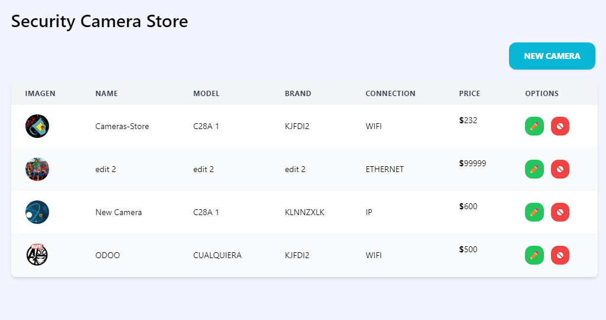
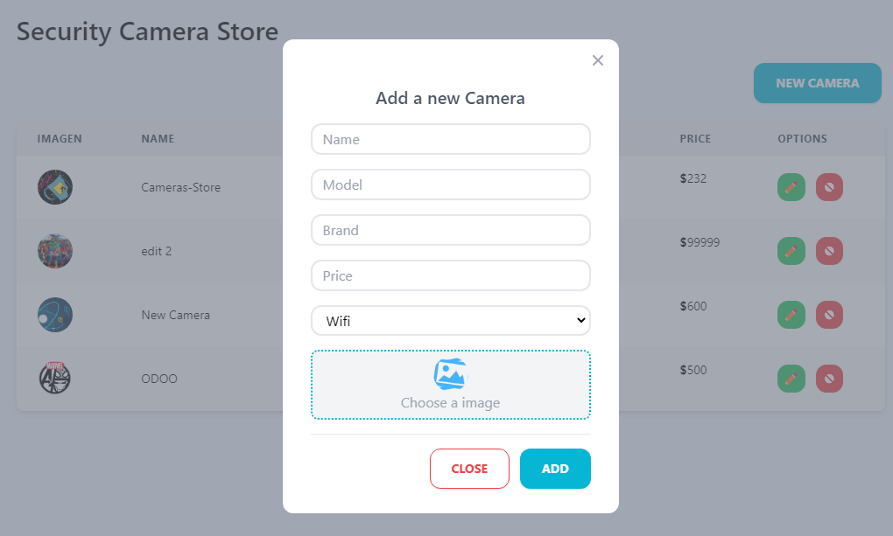
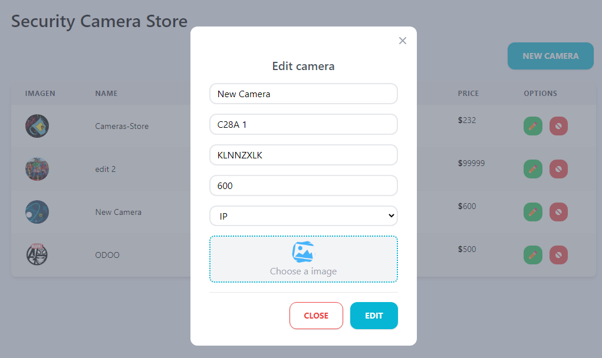
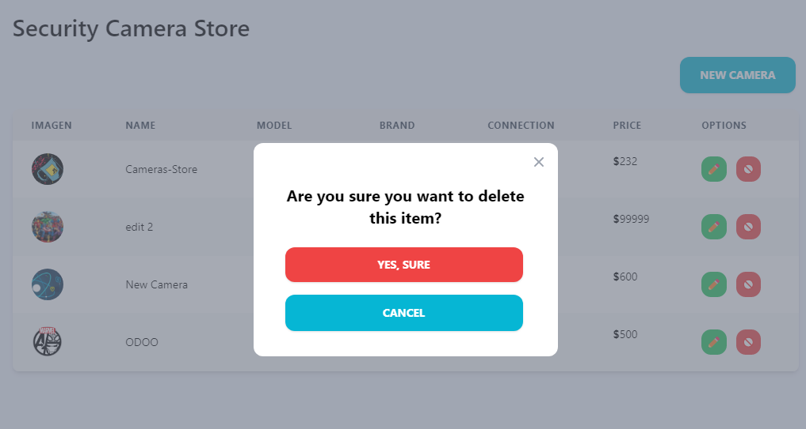

# School App  

## Table of Content

- [About The Project](#about-the-project)
  - [Description](#description)
  - [Built With](#built-with)
- [Installation](#installation)
- [Usage](#usage)
- [Demo](#demo)
- [Contact](#contact)

## About The Project

<!-- 





 -->

## Description

This project is a complete CRUD of a school app made with ReactJS and TailwindCSS.

## Built With

[](https://reactjs.org)

[](https://tailwindcss.com)

## Installation

1. Clone the repo.

```sh
  git clone https://github.com/mohamed2020m/student.git
```

2. Install NPM packages

```sh
  yarn install
```

## Usage

Run the project in development

```npm
  yarn dev
```

Build the project

```npm
  yarn build
```

## Demo


## Contact

- Gmail - [mohamedessabir20@gmail.com](mailto:mohamedessabir20@gmail.com)
- Instagram - [leeuw_med](https://www.instagram.com/leeuw_med)
